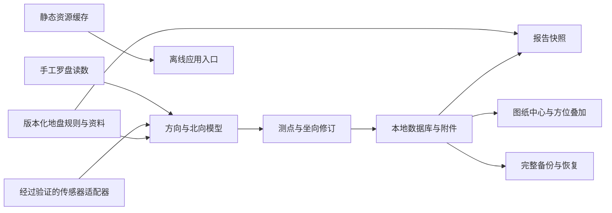

# Design

## Context

仓库从空目录初始化，已按本设计实现主要现场手录闭环、图纸、备份报告与 PWA。Git 远端为 `https://github.com/unknownparticles/fengshui.git`（origin），main 已推送并核实为远端默认分支；GitHub CI 验证通过，正式站点待实机验收。用户选择专业罗盘与现场堪舆，产品范围见 [proposal.md](proposal.md)，领域约定见 [domain-reference.md](../../../docs/research/domain-reference.md)，技术依据见 [sources.md](../../../docs/research/sources.md)。

GitHub Pages 不提供后端；项目站点默认有仓库子路径。移动浏览器存在传感器、安装、存储和打印差异，现场可能完全离线。不能用安装成功、角度小数位或读数稳定性替代精度验证。

## Goals / Non-Goals

**Goals:**

- 将方向数学、传感器适配、规则资料、持久化与视图分开，使手工流程和设备增强共用同一领域模型。
- 采用明确版本和快照，保证复测、坐向修订、规则更新和报告历史可追踪。
- 单套静态产物架构可按配置适配根路径与仓库路径，主要功能预缓存且没有运行期第三方服务依赖。
- 为存储失败、权限拒绝、更新延迟及旧代码读取新数据定义可实现的恢复路径。

**Non-Goals:**

- 首版不实现真实三合盘、分金或排盘算法，也不做地形识别、自动判定建筑坐向与后台连续测量。
- 不建设服务端、云同步、端到端加密共享或账户体系。数据存于浏览器，不宣称浏览器存储是加密档案库。
- 不承诺专业仪器精度，不把浏览器打印等同于跨平台一致的 PDF 文件生成。

## Decisions

### 1. 静态前端与模块边界

采用 TypeScript、React、Vite；路由使用 Hash 方式。PWA 用 `vite-plugin-pwa` 的 `injectManifest` 与自定义 SW，数据库用 IndexedDB（通过 `idb`），ZIP 备份使用 `fflate`；依赖版本已在实施时核对并锁定，记录于 package.json 与 package-lock.json。

选用这些工具是为了静态构建、类型明确、图片叠加和本地状态维护。服务端渲染会增加 Pages 部署负担；`localStorage` 不适合图纸附件；自动立即更新会打断采样，故使用可控制的 SW 生命周期。图纸盘面以 SVG 叠加在本地重新编码的图片上，界面不引入 Three.js 或摄像头。

建议模块：`domain/direction`（纯数学）、`domain/rules`（固定数据与版本）、`adapters/orientation`（接口适配）、`storage`（事务与迁移）、`features/compass`、`features/surveys`、`features/plans`、`features/knowledge`、`features/reports`、`pwa`。

### 2. 用户流程与页面

底部导航：罗盘、项目、资料、设置。项目页内进入测点、观察、图纸和报告；桌面可使用侧栏。360px 起主要页面单列，测量页优先大字号角度、当前山向、质量文字和锁定／保存操作，盘层默认标示地盘正针。采用瓷白／墨黑两种主题、少量铜金强调，默认跟随系统并可保存人工偏好；普通文字对比度至少 4.5:1，重要控件／图形至少 3:1，按钮触控区域至少 44px。密集记录在手机先显示摘要，详情用明确按钮展开；正式锁定的阻碍与保存失败保持主屏可见。

典型流程：建立项目和测点 → 选择对象及参考北 → 手录或点击启动传感器 → 确认姿态／质量 → 锁定并保存三次 → 明确建筑取向依据 → 确认采用值 → 添加观察与图纸 → 生成脱敏报告 → 下载完整备份。即使缺失图纸或砂水资料也能生成标明缺项的报告。

品牌暂用“风水堪舆现场工具”；页面、原创组件、主题 token、动效和中文状态文案见 [UI 设计约定](../../../docs/design/ui-guidelines.md)。S16—S18 核查见 [UI 参考](../../../docs/research/ui-references.md)，首版以本地 React／CSS／SVG 实现；Roxy UI 排盘结果组件不替代方向采集，不增加联网 API 或 CDN 依赖。主题切换不重启采样或清空草稿，减少动态效果时停止装饰过渡。

### 3. 角度与传感器状态机

方向数学采用领域参考中的完整二十四山表、半开区间及环形计算。所有分类使用未舍入值，显示层才格式化。测量上沿指向目标，仅接受经验证的竖屏平放传感器姿态；横屏提供暂停提示和手录。

状态：`idle → requesting → collecting → stable → locked`，另有 `denied / unsupported / no-data / unknown-north / stale / unstable / wrong-pose`。隐藏页面、离开测量页、重新启动测量均清空窗口；锁定对象持有不可变结果及统计，采集事件不再更改它。

适配器须提供来源名、API、原始值、北向基准、倾斜、时间、有效精度字段和验证版本。优先检测 WebKit compass 扩展，再检测绝对方向事件；两者均不因字段存在就自动认定磁北。每个启用平台在实体罗盘／已知方向下核实符号、屏幕朝向、北向基准和失败路径；无法确定参考北的设备只展示 unknown 状态及手录入口。禁止无条件 `360-alpha`。

采样质量初值：3 秒／10 样本／最大最短角差 ≤3°／向量长度 ≥0.1／事件新鲜度 2 秒／beta、gamma 各 ±15°／有效厂家精度 ≤5°。这些是工程筛选阈值，不是误差担保。独立锁定间重新采样；每次最多保留最近 300 个合格事件，低于 10 个不锁定。保存时保留本窗口样本和摘要，不长期保存无限事件流。

默认磁北。人工磁偏角额外要求来源、适用日期和地点说明；一条记录只有一个原始基准和一个输出基准，换算始终从原始值做一次。多次复测推荐值只聚合同对象且同基准记录，跨度使用环形最短覆盖弧，不使用最大值减最小值。

### 4. 数据模型与报告复现

| 实体 | 关键字段 |
| --- | --- |
| Project | id、名称、可选地点／坐标、createdAt、updatedAt、archivedAt、activeAdoptionId |
| SurveyPoint | id、projectId、名称、对象类型、位置说明 |
| Measurement | id、pointId、对象、输入坐／向、原始角度／参考北、输出角度／参考北、来源、磁偏角信息、时间／时区、原始采样窗口、质量统计／配置版本、规则版本 |
| AdoptionRevision | id、projectId、pointId、关联测量 ids、取向依据、采用向角／参考北、人工／推荐确认、原因、前一修订 id |
| Observation | id、pointId、分类、事实、人员判断、可选方位／参考北、附件 ids、资料条目及版本、时间 |
| Attachment | id、projectId、type、重新编码 blob、MIME、字节数、尺寸、摘要 |
| PlanOverlay | id、projectId、图纸附件 id、归一化中心 x/y、图顶角、参考北、关联采用修订 id、显示设置、规则版本、待复核状态 |
| ReportSnapshot | id、projectId、生成时间／时区、应用／规则版本、采用修订、必要条目及附件快照、脱敏选择 |
| KnowledgeEntry | id、标题、关键词、分类、原文／注释／原创解释、版本、审核状态、sourceIds |
| SourceRecord | id、URL、作者／版本／章节、获取日期、许可状态、文件获取状态、规则核验状态、可选仓库／commit SHA／路径／内容摘要、审核说明 |

时间以 ISO 8601 UTC 存储，并保存设备时区用于报告显示；新建默认使用设备时区，当前文档日期按 Asia/Shanghai。自动保存在修改后 1 秒内尝试，事务成功才发出“已保存”，多页签编辑采用 revision 检查避免最后写入静默覆盖。

规则文件随构建分发，采用 `earth-plate-v1` 固定数据。报告包含引用资料与必要规则快照；规则升级不改写历史。图纸替换或坐向变更产生新叠加／修订；历史报告引用的旧附件不作为孤立文件被自动清除。

外部仓库先进入 SourceRecord 候选清单，文件存在性、许可证和规则一致性分别审核；unknown 不能升级为 approved。S13—S15 的静态核查见 [仓库核查](../../../docs/research/github-repositories.md)：首版参考信息结构，不安装 Skill、不执行其脚本、不把 main 分支内容作为动态运行依赖。已审核知识资料构建时打包固定版本；页面中的参考线索可以显示仓库地址及缺口，不提供未取得或未获授权的全文。

### 5. 本地图片与空间叠加

支持 PNG/JPEG/WebP，10 MiB 和 20 百万像素限制，在可行的头部检查后解码确认尺寸；失败时不提交替换。统一经过浏览器图片解码和 Canvas 重新编码，应用 EXIF 朝向并移除元数据，以该结果作为原图。照片与图纸都不请求 URL 图片、不上传；不接受 SVG／PDF，避免脚本和新增解析负担。

中心保存为图像坐标 `[0,1]` 的 x/y；用户指定图顶方位角 T。方位扇区相对图顶的角度为 `normalize(H-T)`，SVG 的 0° 沿图像上方，顺时针。例：T=90° 时北在左侧。缩放／平移共用变换容器。不能仅凭大门方向确定图顶，用户必须确认二者关系。

### 6. 备份、导入和数据兼容

完整备份采用 ZIP：`manifest.json`、实体 JSON、`attachments/<id>.<ext>` 与报告快照；manifest 含 schemaVersion、应用／规则版本、文件清单、字节数和 SHA-256 摘要。摘要用于完整性检查，不代表签名或来源真实性。脱敏报告输出独立 HTML，内嵌必要样式与选中的已清元数据图片，打开后可离线打印。

首版备份输入上限：压缩文件 100 MiB、累计展开 250 MiB、附件 200 个；每图仍满足单图限制。只解压清单允许的固定目录，拒绝绝对路径、`..`、重复名和压缩炸弹。导入先在内存／临时区完整校验、预览，再将本次项目与引用作为单次事务写入；配额异常回滚。仅内存模式导入也先校验，再一次性替换内存状态。

已有项目冲突时按副本导入：生成新 project／point／measurement／revision／attachment／report 标识并重映射全部引用；时间和原始内容版本保留。首版 schemaVersion=1；未来迁移必须先生成可导出的旧数据快照，再转换；遇到未知较新版本只读，并提供原始数据及附件的备份导出，不尝试降级或清空。数据库打开使用检测实际版本的兼容入口，不能因 VersionError 创建同名空库。

设置页展示 origin 存储估计与本应用附件统计，并支持用户主动请求 `persist()`；结果只标“获准／未获准／不支持”。用户删除项目需最终确认，全部清理只遍历本应用 stores／缓存。多个同源 Pages 站点用基路径派生 namespace，但名称隔离不是防御同源脚本访问的安全边界。

### 7. PWA 缓存与更新

自定义 SW 预缓存带版本的核心资源、所有核心懒加载 chunk、manifest、图标与已审核资料；不以真实项目附件作为预缓存。IndexedDB 放项目，Cache 放静态资源，职责分开。离线准备界面核查资源清单可读及 SW 控制状态，缓存失败保持未就绪。

不在页面加载时自动 `skipWaiting`；waiting worker 通知新版本，用户同意且所有草稿写入成功后切换。多页签均有未保存修改或采样时提示关闭／保存其他页签，禁止直接刷新。清理旧缓存只匹配本应用 namespace；激活新版本时确保当前页面资源链可用，失败保留旧 worker 和缓存。

SW 文件、scope、manifest URL、start_url 和 id 都使用统一 `DEPLOY_BASE_PATH`。实现中对 Cache 中的状态码和 MIME 逐项核查，确认核心清单可读后才显示离线就绪；清理后可重新联网准备。`/fengshui/` 项目不能注册 `/sw.js` 或根 scope。地址变化／自定义域名切换视为不同安装入口，提前导出备份再迁移；不能假设浏览器自动移动 origin 数据。

### 8. 构建、发布与回滚

实施时提供 npm 脚本 `typecheck`、`test`、`build`、`test:e2e`。Node 使用当时受支持 LTS，锁文件入仓；Actions 版本核对官方发行并固定，不能照搬资料页可能过期的标签。

CI 对 PR 运行 OpenSpec 严格校验、类型检查、关键算法／备份／迁移测试、生产构建及子路径静态冒烟；正式部署仅在配置的默认分支或人工 dispatch 上执行，通过 `configure-pages → upload-pages-artifact → deploy-pages` 发布 `dist`，部署任务依赖验证／构建，权限限定为 `contents: read`、`pages: write`、`id-token: write`，environment=`github-pages`。实际默认分支来自仓库配置，不硬编码假定当前为 main。

部署说明涵盖 Pages Source=GitHub Actions、HTTPS、目标 base、安装和离线准备检查。目标仓库为 `unknownparticles/fengshui`，计划 Pages 地址为 `https://unknownparticles.github.io/fengshui/`，构建 `DEPLOY_BASE_PATH=/fengshui/`；manifest 和 SW 使用相同前缀。该地址是发布目标，当前尚未启用／验证 Pages。根路径部署仍保留独立构建验收，以支持将来迁移域名。

回滚重新发布前一已验证产物，旧应用仍保留对新数据的只读与原始备份出口；数据迁移不自动反向执行。发布版本、提交和规则版本均写入关于页。发布 gate 分离“自动验证通过”与“实机北向适配可启用”，未验证设备保持手录降级。

## Risks / Trade-offs

- [稳定读数仍可能有磁场偏差] → 保留精度未知、复测与实体罗盘手录，实机对照后才启用适配器；不保证亚度级精度。
- [流派解释与古籍编校有差异] → 首版规则边界固定，逐条审核和来源版本化，未审核内容不参与解释。
- [浏览器回收本地数据] → 主动备份、持久化状态和保存失败提示；安装不视为备份。
- [同源 Pages 项目共享 origin] → namespace 防止误清理；含敏感项目的用户可后续采用独立域名；首版不提供同源安全隔离承诺。
- [图片解码和 ZIP 导入占内存] → 体积、像素、展开量限制，逐文件处理，失败回滚；旧移动设备可以只录文字。
- [平台打印与安装差异] → 提供 HTML 报告和平台引导，实机记录差异，不把不支持视作数据丢失。
- [更新或回滚遇到新数据版本] → 兼容检查、只读原始导出、禁止清库；发布前验证升级与回滚路径。

## Migration Plan

1. 按任务建立应用与规则审核清单，先完成纯手工现场闭环与本地备份。
2. 完成传感器实机验证；不满足北向基准要求的设备继续手录。
3. 实现离线预缓存与等待更新，验收飞行模式冷启动和保存失败恢复。
4. 向已关联的 origin 推送项目，核实 main 为远端默认分支并配置 Pages；使用 `/fengshui/` 基路径构建，完成项目路径及根路径验收。
5. 实机矩阵通过后发布首版，记录版本／提交；应用任务全部验收完成后归档当前 OpenSpec。

## Open Questions

- 最终品牌名称与图标图形：两主题和现场界面已明确，名称与具体图标不影响首版行为。
- 是否将来迁移独立域名：首版已采用 `unknownparticles/fengshui` 项目路径，后续迁移按既有备份和基路径机制处理。
- 后续优先采用哪套三合／三元／玄空规则版本：当前首版已明确排除，新增能力通过独立提案处理。
